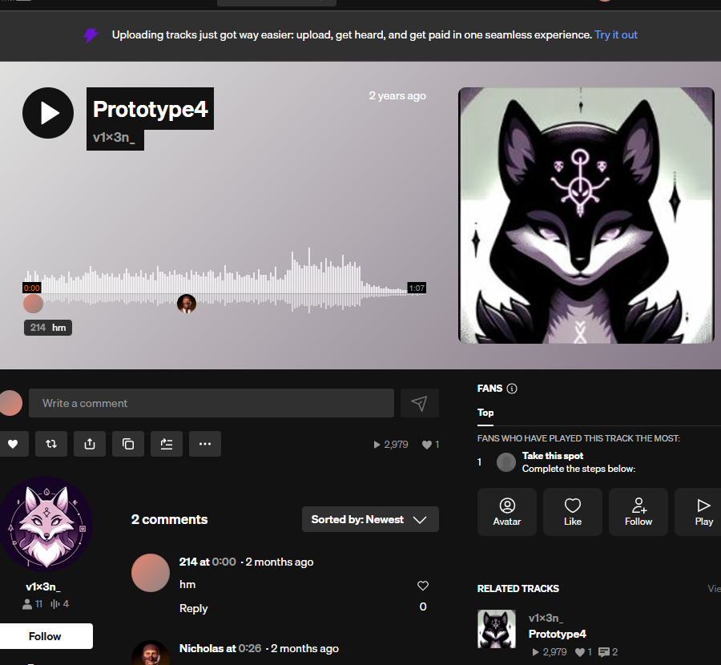
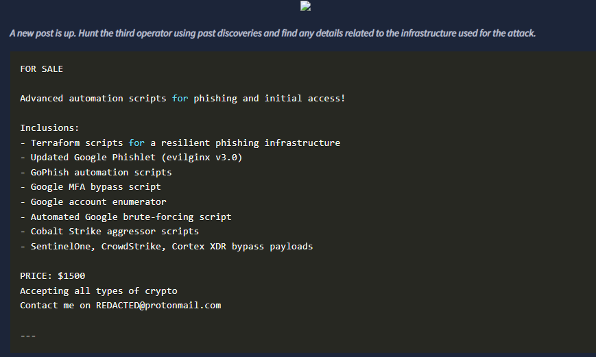
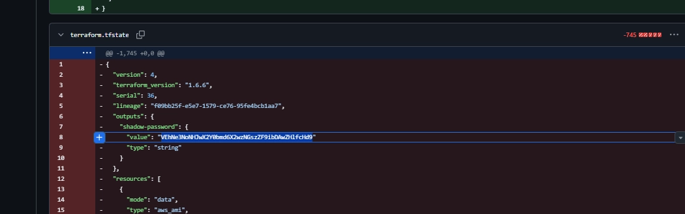

# 🔥 We will be going through an OSINT challenge name Operation Slither:

 
 
 
 
 
 

## First part of the challenge:

### Q1:Aside from Twitter / X, what other platform is used by v3n0mbyt3_? Answer in lowercase.
- To solve this we need to search for the user <i>v3n0mbyt3_</i> in all platforms.
- We can use an online tool or google dorcking for that
- example:
-   

### Q2:What is the value of the flag?
- Now we have a lead on the attackers, let's scan the messages in the platform we found from pervious step
- check all messages, replys, and media. ( hint: you will find the solution in the replys)
- Got it!, we found a base64 string , we just need to decode it. You can use a website similar to dencode.com
 
 
 
 
 
 

## Second part of the challenge: ( The Sidekick):

- Here we need to build on the previous info we gathered

 
 
 
  
### Q1:What is the username of the second operator talking to v3n0mbyt3 from the previous platform?
- After we found the first username we found messages between the first user and the user we're looking for now.
- to solve this question just check the replys in the platform we found. ( give a try)
 
 
 

### Q2:What is the value of the flag?
- Here we go have to dig deeper.
- We need to find digital footprints for The second user user we found. ( we can use google dorking or any other website or sherlock in kali)
- After searching we found few accounts, but only one is interesting:
  

- Now we look inside each track in the user playlist. ( you will find a base64 string in the description of one of these tracks)
 
 
 
 
 
 

## The third Part: ( The Last Operator):

- We will build on what we already now about the users, websites, and other accounts.
 
 
 
### Q1: What is the handle of the third operator?
- In order to solve this question, we need to check the previous website and look for any connections, likes, or anything interesting ( ignore base64 in comments)
- The solution for thi question resides in the prototype 2 track in the website we found.
 
 
 
### Q2: What other platform does the third operator use? Answer in lowercase.
- We will search for the user we found from pervious step ( look for the same username in other platforms)
- You will find an account related to developement and project sharing ( starts with G)
 
 
 
### Q3: What is the value of the flag?
- Now we need to look around inside the account we found in (Github) for that account
- After checking, We found a repo.
- Let's check it's commits and history, pay close attention to deleted files in one of the commits
- Let's reload the deleted file:

# 🔥 Glad to share First Walk Through, I hope you enjoyed the hints 🔥
  

