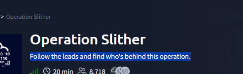
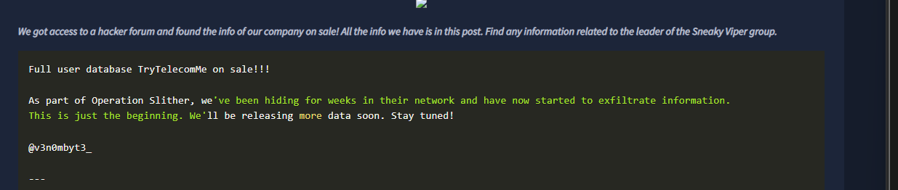
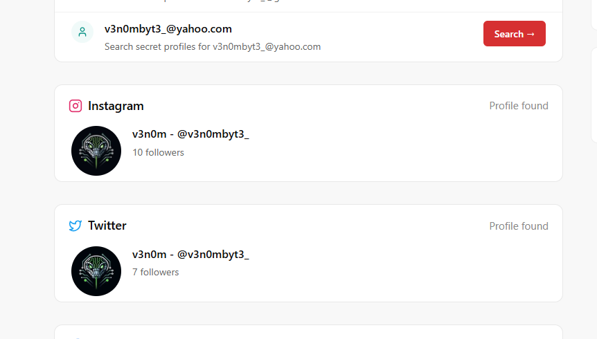
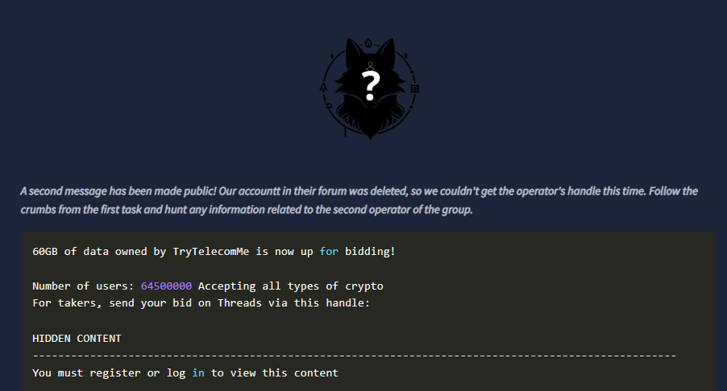

# 🔥 We will be going through an OSINT challenge name Operation Slither:

## First part of the challenge:

### Q1:Aside from Twitter / X, what other platform is used by v3n0mbyt3_? Answer in lowercase.
- To solve this we need to search for the user <i>v3n0mbyt3_</i> in all platforms.
- We can use an online tool or google dorcking for that
- example:
-   

### Q2:What is the value of the flag?
- Now we have a lead on the attackers, let's scan the messages in the platform we found from pervious step
- check all messages, replys, and media. ( hint: you will find the solution in the replys)
- Got it!, we found a base64 string , we just need to decode it. You can use a website similar to dencode.com

## Second part of the challenge: ( The Sidekick):

